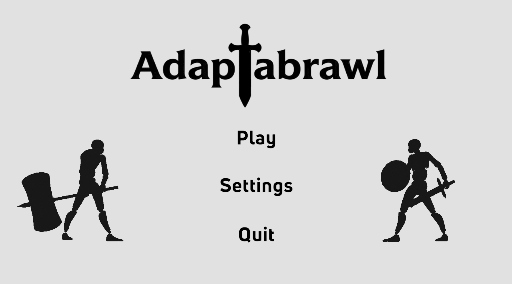
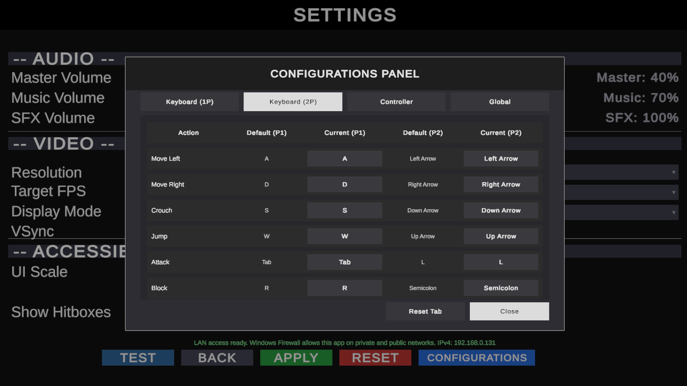
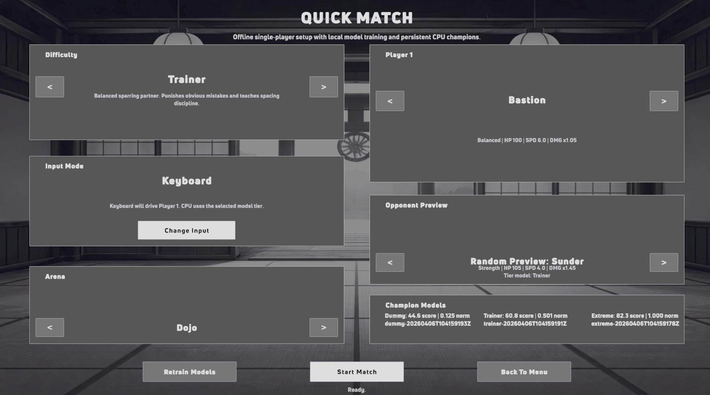
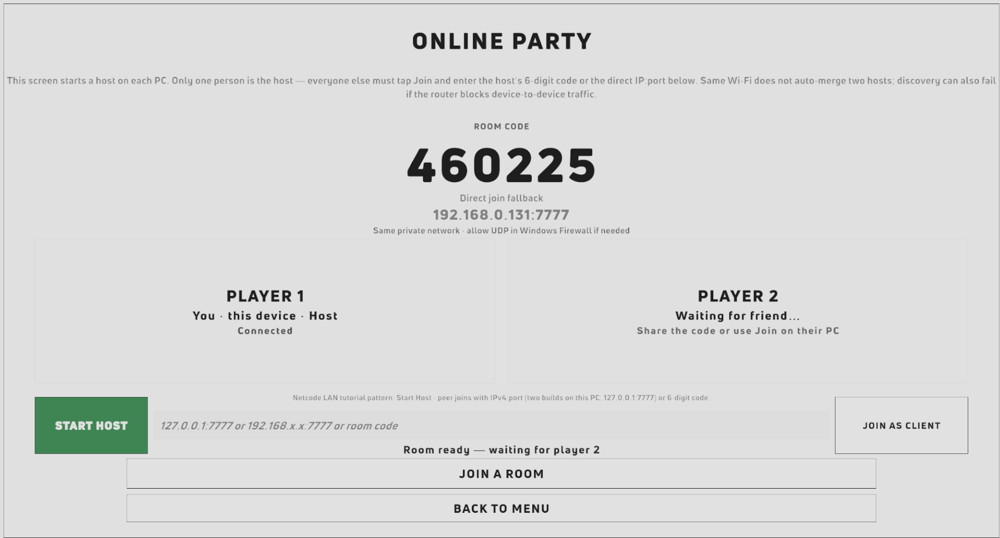
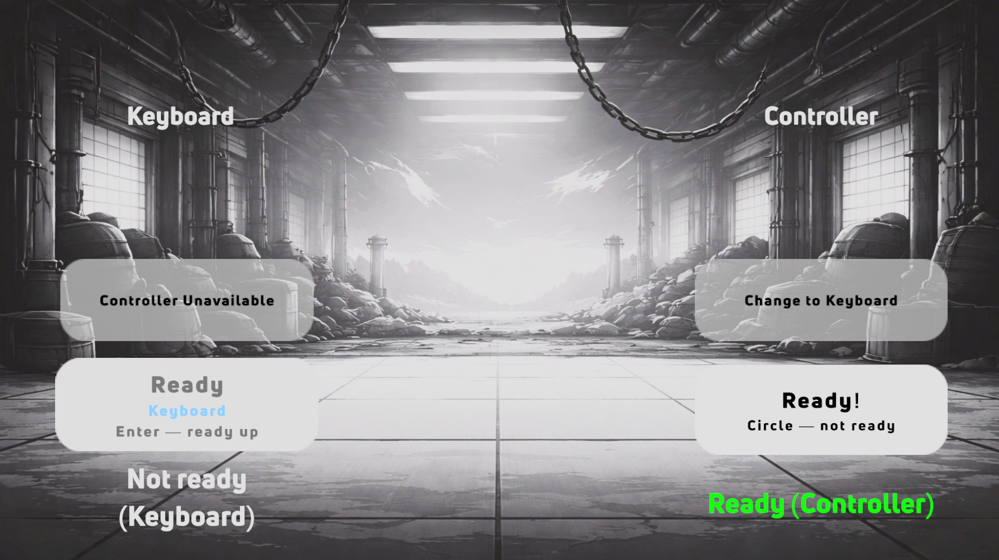
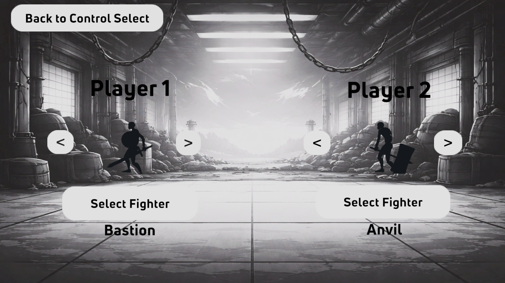
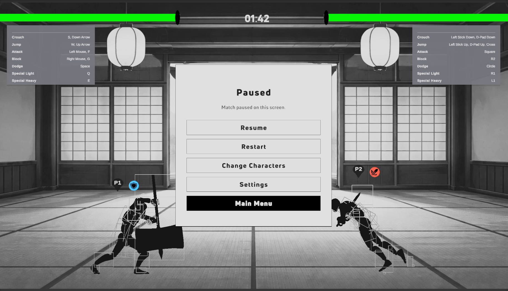
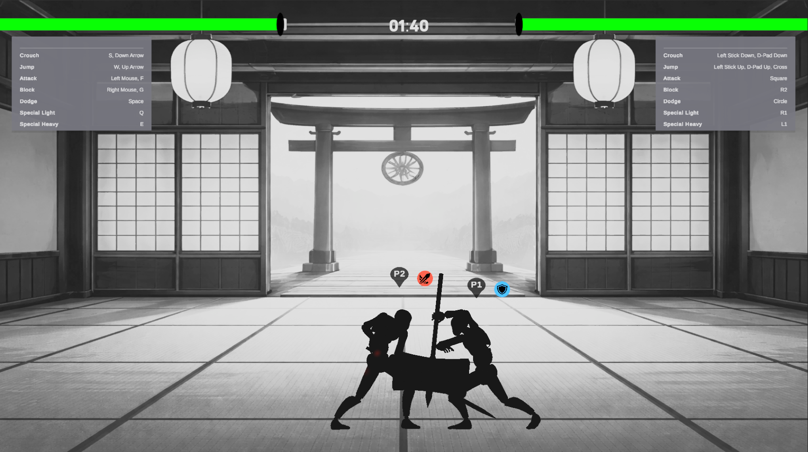
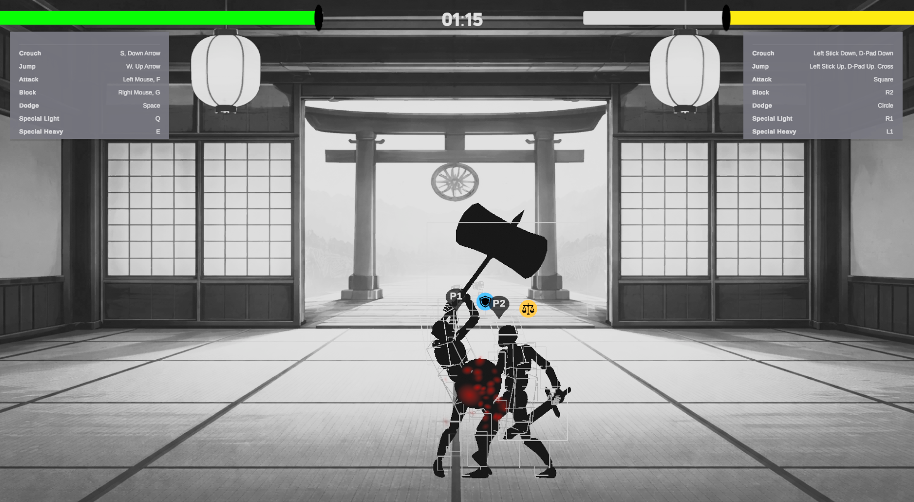
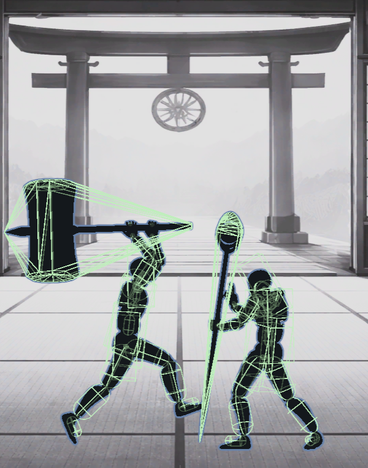

# Adaptabrawl — Final Design Report (Spring 2026)

**Course:** CS5002 Senior Design  
**Project:** Adaptabrawl (2D Multiplayer Fighting Game)  
**Institution:** University of Cincinnati  
**Team:** Kartavya Singh, Saarthak Sinha, Kanav Shetty, Yash Ballabh  
**Repository:** [Adaptabrawl-Senior-Design](https://github.com/Kartavya904/Adaptabrawl-Senior-Design)

---

## Table of Contents

1. [Project Description](#1-project-description)
2. [User Interface Specification](#2-user-interface-specification)
3. [Test Plan and Results](#3-test-plan-and-results)
4. [User Manual](#4-user-manual)
5. [Spring Final PPT Presentation](#5-spring-final-ppt-presentation)
   - [Expo demo video](#51-expo-demo-video-spring-2026)
6. [Final Expo Poster](#6-final-expo-poster)
7. [Assessments](#7-assessments)
8. [Summary of Hours and Justification](#8-summary-of-hours-and-justification)
9. [Summary of Expenses](#9-summary-of-expenses)
10. [Appendix](#10-appendix)
11. [Tech Stack](#11-tech-stack)
12. [Team Members and Responsibilities](#12-team-members-and-responsibilities)
13. [Project Outcomes and Future Work](#13-project-outcomes-and-future-work)

---

## 1. Project Description

### 1.1 Project Abstract

Adaptabrawl is a 2D multiplayer fighting game that combines attack, defense, and evasion with adaptive match modifiers (status effects, stage conditions, and readability-first HUD cues). The final build supports local and room-code online play, character selection, configurable settings, and documented testing. The project emphasizes fair, legible combat and modular Unity architecture for maintainable growth.

### 1.2 Final Project Overview

Adaptabrawl was built as a full-year senior design project to deliver a competitive but accessible fighting game experience. The final version focuses on:

- readable combat states (icons, timers, telegraphs, condition disclosure),
- robust gameplay loop (menu -> select -> match -> results -> rematch),
- support for local and online room-based sessions,
- maintainable architecture using ScriptableObjects and modular systems,
- complete supporting artifacts (tests, user docs, presentation, poster, assessments).

### 1.3 Key Features Delivered

- 1v1 local multiplayer support.
- Online lobby with room-code workflow.
- Character select with ready-state flow.
- Core combat actions: light/heavy attack, block, dodge/parry logic.
- Status/condition-aware gameplay messaging.
- Match results and replay/rematch navigation.
- Settings and persistence for key gameplay experience options.

---

## 2. User Interface Specification

UI is organized around a clear player journey with low-friction navigation and state visibility.

### 2.1 Primary Screen Flow

1. Start/Main Menu
2. QuickMatch Route
3. Local/Online route selection
4. Lobby (online) or Character Select
5. Match gameplay scene with HUD
6. Match Results screen
7. Rematch / Character Select / Main Menu

### 2.2 UI Design Goals

- **Readability:** health, status, and condition information is visible and understandable in real time.
- **Consistency:** navigation patterns and button intent remain stable across screens.
- **Responsiveness:** options are reachable in minimal steps for both keyboard and controller users.
- **Feedback:** every critical user action returns clear state confirmation.

### 2.3 Interface Snapshot Gallery

> These screenshots are selected from the project media folder to document the current visual implementation.

#### Main Menu / Home

#### Settings

#### Quick Match

#### Online Lobby

#### Team Formation / Selection Stage

#### Character Select

#### Gameplay

#### Combat Debug/Design Evidence

---

## 3. Test Plan and Results

### 3.1 Test Plan Source

- Primary test plan document:  
  [`Homework Deliverables/Spring 2026/01 - Test Plan/TestPlan.md`](../01%20-%20Test%20Plan/TestPlan.md)

### 3.2 Testing Strategy Summary

Testing was performed in two layers:

- **Module-level validation:** combat logic, movement, status/condition behavior, and data loading.
- **Integration and end-to-end validation:** menu and scene transitions, lobby flows, ready-state synchronization, HUD updates, and post-match navigation.

Additionally, stress/performance checks targeted consistent gameplay on typical development hardware.

### 3.3 Results Summary by Category

| Category             | Coverage Intent                                         | Observed Outcome (Final Build)                                                                    |
| -------------------- | ------------------------------------------------------- | ------------------------------------------------------------------------------------------------- |
| Combat and damage    | Hit detection, damage application, defense interactions | Core combat loop behaves as designed in local matches; key interactions are playable and readable |
| Movement/evasion     | Ground/air state handling, dodge timing                 | Movement and evasion mechanics are functional in baseline scenarios                               |
| Status/conditions    | Timed effects and modifier display                      | Status application and player-facing disclosure are present                                       |
| UI/menus             | Main menu, select, pause, results, rematch              | End-to-end navigation path is completed and usable                                                |
| Lobby/session        | Room-code create/join + ready flow                      | Online room lifecycle is implemented with practical join flow                                     |
| Persistence/settings | Settings survive restart                                | Settings persistence pathway is implemented and documented                                        |
| Performance          | Stable playability under normal load                    | Acceptable playability achieved for team demo and presentation contexts                           |

### 3.4 Test Evidence and Execution Artifacts

- Test definitions and matrix: `TestPlan.md`
- Demo-ready gameplay evidence: media images + expo assets
- User-facing validation: user manual + FAQ walkthrough coverage

---

## 4. User Manual

### 4.1 Documentation Links

- User docs index: [`User_Docs.md`](../02%20-%20User%20Docs/User_Docs.md)
- User manual: [`User_Manual.md`](../02%20-%20User%20Docs/User_Manual.md)
- Getting started: [`Getting_Started.md`](../02%20-%20User%20Docs/Getting_Started.md)
- FAQ: [`FAQ.md`](../02%20-%20User%20Docs/FAQ.md)

### 4.2 User Manual Scope

The user documentation includes:

- setup and run instructions,
- local and online play instructions,
- control mappings and gameplay basics,
- HUD/status interpretation,
- settings behavior and persistence,
- match lifecycle and post-match actions.

### 4.3 FAQ Inclusion (Required)

FAQ is included and linked in section 4.1 above. It addresses setup issues, controls, online room workflow, gameplay mechanics, settings/performance, and troubleshooting.

---

## 5. Spring Final PPT Presentation

- Spring expo presentation file:  
  [`Homework Deliverables/Spring 2026/03 - Expo Presentation/AdaptaBrawl_Expo_Presentation.pptx`](../03%20-%20Expo%20Presentation/AdaptaBrawl_Expo_Presentation.pptx)

### Presentation Coverage

- Project objective and final scope
- Technical architecture and implementation progress
- Gameplay/system demonstration
- Team role contributions and outcomes

### 5.1 Expo demo video (Spring 2026)

Screen recording from the **Senior Design Expo** showcase (live demo / booth capture):

- **[Adaptabrawl_Expo_Demo.mp4](../../../Miscellaneous/Media/Video/Adaptabrawl_Expo_Demo.mp4)**

---

## 6. Final Expo Poster

- Final poster file:  
  [`Homework Deliverables/Spring 2026/05 - Expo Poster/AdaptaBrawl_Expo_Poster.pdf`](../05%20-%20Expo%20Poster/AdaptaBrawl_Expo_Poster.pdf)

### Poster Notes

The poster summarizes problem statement, project solution, design architecture, implementation highlights, and final deliverable readiness for public/demo audiences.

---

## 7. Assessments

### 7.1 Initial Self-Assessments (Fall Semester)

- Kartavya Singh (placeholder/link update if needed):  
  [`Homework Deliverables/Fall 2025/...`](../../Fall%202025/)
- Saarthak Sinha (placeholder/link update if needed):  
  [`Homework Deliverables/Fall 2025/...`](../../Fall%202025/)
- Kanav Shetty (placeholder/link update if needed):  
  [`Homework Deliverables/Fall 2025/...`](../../Fall%202025/)
- Yash Ballabh (placeholder/link update if needed):  
  [`Homework Deliverables/Fall 2025/...`](../../Fall%202025/)

### 7.2 Final Self-Assessments (Spring Semester)

- Kartavya Singh:  
  [`Final_Individual_Self_Assessment_Singhk6.txt`](../06%20-%20Self%20Assessment/Final_Individual_Self_Assessment_Singhk6.txt)
- Saarthak Sinha: **TBD link**
- Kanav Shetty: **TBD link**
- Yash Ballabh: **TBD link**

### 7.3 Confidential Team Assessments

Per assignment requirement, confidential team-assessment content is excluded from this report.

---

## 8. Summary of Hours and Justification

> This section is intentionally comprehensive and editable. Replace estimates with final approved values if needed.

### 8.1 Fall + Spring + Yearly Totals by Team Member

| Team Member       | Fall Hours | Spring Hours | Year Total Hours |
| ----------------- | ---------: | -----------: | ---------------: |
| Kartavya Singh    |         45 |           60 |              105 |
| Saarthak Sinha    |         45 |           50 |               95 |
| Kanav Shetty      |         45 |           50 |               95 |
| Yash Ballabh      |         45 |           50 |               95 |
| **Project Total** |    **180** |      **210** |          **390** |

### 8.2 Per-Person Justification Paragraphs

**Kartavya Singh**  
Focused on netcode/infrastructure integration, scene-to-scene gameplay flow, online session readiness, and cross-cutting stabilization work needed to keep branches converging into a demo-ready build. Time includes debugging, integration management, technical documentation updates, and expo preparation.

**Saarthak Sinha**  
Focused on combat mechanics, fighter and move behavior, balancing/tuning activities, and systems-level gameplay features. Time includes implementation, playtest-driven tuning, bug resolution, and collaboration on final gameplay quality.

**Kanav Shetty**  
Focused on UI/UX consistency, visual gameplay communication, stage/presentation-facing design quality, Online Play Infrastructure, and user readability outcomes. Time includes UI implementation, scene polish, usability improvements, and visual documentation support.

**Yash Ballabh**  
Focused on tooling/QA orientation, project workflow support, validation activities, and test-minded improvements. Time includes test support, automation/process contributions, debugging support, and packaging for deliverables.

### 8.3 Evidence of Hours (Required)

Evidence sources (linkable and reviewable):

- Git commit history and contributor graph:  
  [GitHub Contributors](https://github.com/Kartavya904/Adaptabrawl-Senior-Design/graphs/contributors)
- Homework deliverables across semesters:  
  [`Homework Deliverables`](../../)
- Meeting cadence and notes summary in repository README:  
  [`README.md`](../../../../README.md)
- Individual self-assessments and written reflections:

---

## 9. Summary of Expenses

### 9.1 Monetary Expense Summary

| Item                                |                    Cost | Type                    | Notes                                |
| ----------------------------------- | ----------------------: | ----------------------- | ------------------------------------ |
| Unity Personal                      |                      $0 | Software (donated/free) | Free tier                            |
| Mirror and related OSS dependencies |                      $0 | Software (donated/free) | Open-source tooling                  |
| GitHub hosting (free tier)          |                      $0 | Platform (donated/free) | Repository collaboration             |
| Existing team hardware              | $0 direct project spend | Hardware (donated)      | Personal/dev machines                |
| Shinabro Assets                     |   $26 Single time spend | Unity Asset             | Character Designs and Animations     |
| Expo Poster                         |    $8 Single time spend | Expo Poster             | Expo Poster Printing from 1819       |
| **Total Project Spend**             |                 **$34** | —                       | Only 1 purchased line items recorded |

### 9.2 Donated Hardware/Software

- Personal laptops/workstations used for development and testing.
- Open-source/free software stack used throughout implementation.
- Student-access resources used for course execution.

---

## 10. Appendix

### 10.1 Repository and Core References

- Primary codebase: [Adaptabrawl-Senior-Design](https://github.com/Kartavya904/Adaptabrawl-Senior-Design)
- Unity documentation: [https://docs.unity3d.com/](https://docs.unity3d.com/)
- Mirror networking docs: [https://mirror-networking.com/](https://mirror-networking.com/)
- C# docs: [https://learn.microsoft.com/en-us/dotnet/csharp/](https://learn.microsoft.com/en-us/dotnet/csharp/)

### 10.2 Meeting Notes / Evidence Links

- Repository history and pull/commit logs act as primary verifiable timeline.
- Add direct links to notebooks/meeting notes if separately maintained.

### 10.3 Related Project Artifacts

**Fall 2025**

- Team contract (PDF): [`Adaptabrawl_Team_Contract.pdf`](../../Fall%202025/03%20-%20Team%20Contract/Adaptabrawl_Team_Contract.pdf) · (DOCX) [`Adaptabrawl_Team_Contract.docx`](../../Fall%202025/03%20-%20Team%20Contract/Adaptabrawl_Team_Contract.docx)
- Design diagrams (PDF): [`Design_Diagrams_Adaptabrawl.pdf`](../../Fall%202025/04%20-%20Design%20Diagrams/Design_Diagrams_Adaptabrawl.pdf) · (DOCX) [`Design_Diagrams_Adaptabrawl.docx`](../../Fall%202025/04%20-%20Design%20Diagrams/Design_Diagrams_Adaptabrawl.docx)
- Design diagrams (editable): [`Adaptabrawl_Design_Diagrams.drawio`](../../Fall%202025/04%20-%20Design%20Diagrams/Design%20Diagrams/Adaptabrawl_Design_Diagrams.drawio)
- User stories: [`User_Stories.md`](../../Fall%202025/04%20-%20Design%20Diagrams/User_Stories.md)
- Task list (Markdown): [`Tasklist.md`](../../Fall%202025/05%20-%20Tasklist/Tasklist.md) · (PDF) [`Tasklist_Adaptabrawl.pdf`](../../Fall%202025/05%20-%20Tasklist/Tasklist_Adaptabrawl.pdf)
- Milestones, timeline, and effort matrix (combined PDF): [`Assignment_6_Adaptabrawl_Milestones_Timeline_Effort_Matrix.pdf`](../../Fall%202025/06%20-%20Milestone%2C%20Timeline%2C%20and%20Effort%20Matrix/Assignment_6_Adaptabrawl_Milestones_Timeline_Effort_Matrix.pdf) · (DOCX) [`Assignment_6_Adaptabrawl_Milestones_Timeline_Effort_Matrix.docx`](../../Fall%202025/06%20-%20Milestone%2C%20Timeline%2C%20and%20Effort%20Matrix/Assignment_6_Adaptabrawl_Milestones_Timeline_Effort_Matrix.docx)
- Milestones / timeline / effort matrix (split PDFs): [`Assignment_6_Adaptabrawl_Milestones.pdf`](../../Fall%202025/06%20-%20Milestone%2C%20Timeline%2C%20and%20Effort%20Matrix/Assignment_6_Adaptabrawl_Milestones.pdf) · [`Assignment_6_Adaptabrawl_Timeline.pdf`](../../Fall%202025/06%20-%20Milestone%2C%20Timeline%2C%20and%20Effort%20Matrix/Assignment_6_Adaptabrawl_Timeline.pdf) · [`Assignment_6_Adaptabrawl_Effort_Matrix.pdf`](../../Fall%202025/06%20-%20Milestone%2C%20Timeline%2C%20and%20Effort%20Matrix/Assignment_6_Adaptabrawl_Effort_Matrix.pdf)
- Project constraints (ABET) essay (PDF): [`Assignment_7_Adaptabrawl_Constraints_Essay.pdf`](../../Fall%202025/07%20-%20Project%20Constraint%20Essay/Assignment_7_Adaptabrawl_Constraints_Essay.pdf) · (DOCX) [`Assignment_7_Adaptabrawl_Constraints_Essay.docx`](../../Fall%202025/07%20-%20Project%20Constraint%20Essay/Assignment_7_Adaptabrawl_Constraints_Essay.docx)
- Fall design presentation: [`Assignment_8_Adaptabrawl_Fall_Design_Presentation.pptx`](../../Fall%202025/08%20-%20Fall%20Design%20Presentation/Assignment_8_Adaptabrawl_Fall_Design_Presentation.pptx)
- Fall video presentation (recording): [`Adaptabrawl_Video_Presentation.mp4`](../../Fall%202025/09%20-%20Video%20Presentation%20and%20Peer-Reviews/Adaptabrawl_Video_Presentation.mp4)

**Spring 2026**

- Final design report: [`Adaptabrawl_Final_Design_Report.md`](./Adaptabrawl_Final_Design_Report.md)
- Test plan: [`TestPlan.md`](../01%20-%20Test%20Plan/TestPlan.md)
- User documentation: [`User_Docs.md`](../02%20-%20User%20Docs/User_Docs.md) · [`User_Manual.md`](../02%20-%20User%20Docs/User_Manual.md) · [`Getting_Started.md`](../02%20-%20User%20Docs/Getting_Started.md) · [`FAQ.md`](../02%20-%20User%20Docs/FAQ.md)
- Expo presentation: [`AdaptaBrawl_Expo_Presentation.pptx`](../03%20-%20Expo%20Presentation/AdaptaBrawl_Expo_Presentation.pptx)
- Expo demo video: [`Adaptabrawl_Expo_Demo.mp4`](../../../Miscellaneous/Media/Video/Adaptabrawl_Expo_Demo.mp4)
- Expo poster: [`AdaptaBrawl_Expo_Poster.pdf`](../05%20-%20Expo%20Poster/AdaptaBrawl_Expo_Poster.pdf)

---

## 11. Tech Stack

| Category        | Technology                                             |
| --------------- | ------------------------------------------------------ |
| Engine          | Unity LTS 6000.2.6f2                                   |
| Language        | C#                                                     |
| Networking      | Mirror framework and related Unity multiplayer tooling |
| Version Control | Git + GitHub                                           |
| Architecture    | Modular systems + ScriptableObject-driven data         |
| Platforms       | Windows/macOS (project target contexts)                |

---

## 12. Team Members and Responsibilities

| Team Member      | Primary Role               | Contribution Focus                                              |
| ---------------- | -------------------------- | --------------------------------------------------------------- |
| Kartavya Singh   | Netcode and Infrastructure | Integration leadership, online flow, cross-system stabilization |
| Saarthak Sinha   | Combat and Systems         | Core combat behavior, frame/data logic, gameplay systems        |
| Kanav Shetty     | UX/UI and Content          | User interface, scene readability, visual presentation quality  |
| Yash Ballabh     | Tools, CI/CD, QA           | Process tooling, test support, quality-oriented validation      |
| Vikas Rishishwar | Advisor                    | Advisor for the Adaptabrawl Team                                |

---

## 13. Project Outcomes and Future Work

### 13.1 Final Outcomes

- Completed a playable, documented, and demo-ready fighting game prototype.
- Shipped a full project narrative from design to implementation to expo artifacts.
- Produced technical and user-facing deliverables aligned with course milestones.

### 13.2 Recommended Future Work

- Expand fighter roster and balancing datasets.
- Improve online resilience and latency compensation depth.
- Add deeper telemetry and match analytics for balance iteration.
- Broaden accessibility options and configurable control schemes.
- Build structured continuous playtest pipeline with quantitative reporting.

---

**Document Status:** Final Draft (Comprehensive Version)  
**Last Updated:** Spring 2026  
**Prepared For:** CS5002 Final Design Report Submission
